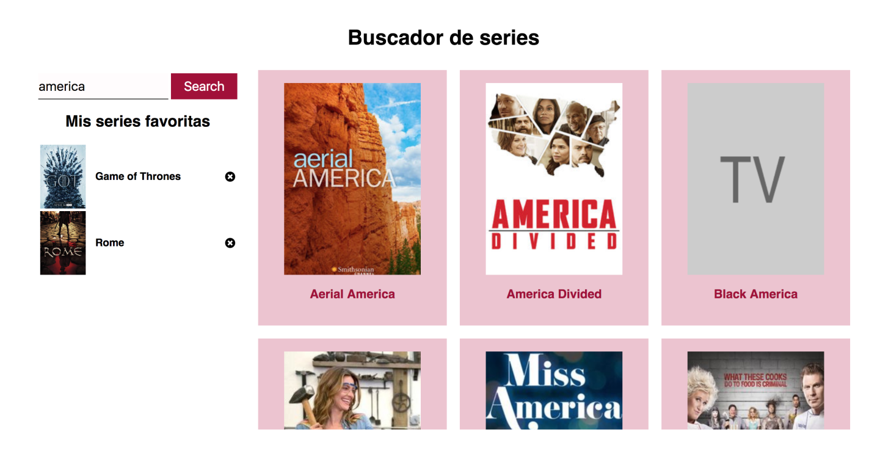
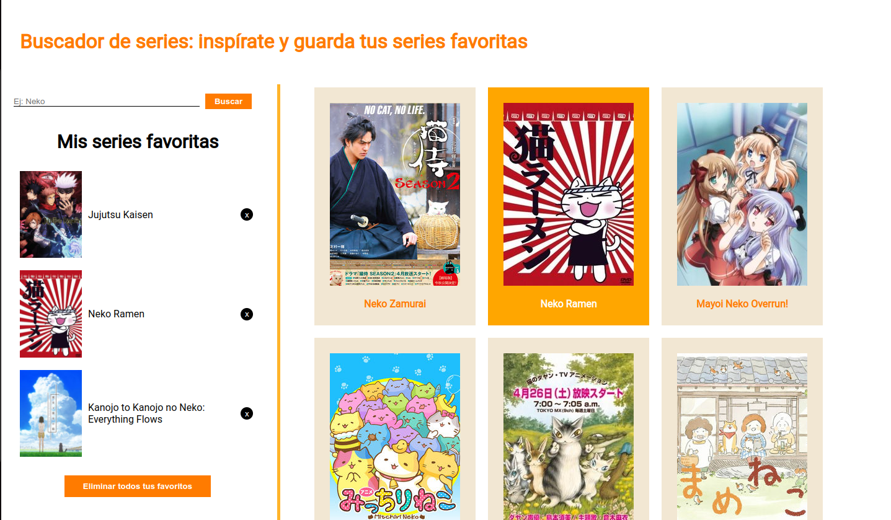

# Descripción del ejercicio

### Buscador de series de TV
Este ejercicio consistía en realizar una aplicación web que te permita buscar series de TV y marcar tus favoritas. Las series favoritas se almacenan en el almacenamiento local del navegador para que puedas acceder a ellas incluso después de recargar la página.

Propuesta gráfica:

Resultado final:

## Funcionalidades

- Buscar series de TV por título.
- Marcar y desmarcar series como favoritas.
- Listar tus series favoritas en la barra lateral.
- Almacenar tus series favoritas en el almacenamiento local del navegador.
- Borrar favoritos individualmente o todos a la vez.

## Cómo usar la aplicación

1. Introduce el título de una serie en el campo de búsqueda y haz click en "Buscar" -> Aparecerá una lista de series coincidentes.
3. Haz clic en una serie para marcarla como favorita o desmarcarla si ya es favorita.
4. Tus series favoritas se mostrarán en la barra lateral izquierda.

## Tecnologías utilizadas

- HTML5
- CSS3 (Sass)
- JavaScript
- Almacenamiento local (localStorage)
- [API de TVMaze](https://www.tvmaze.com/api)

## Herramientas utilizadas
- [Visual Studio Code](https://code.visualstudio.com/)
- [Adalab web starter kit](https://github.com/Adalab/adalab-web-starter-kit)

## DIY
> **NOTA:** Necesitas tener instalado [Node JS](https://nodejs.org/)
1. Clonar este repositorio en tu ordenador.
2. Instalar los módulos: `npm i`
3. Iniciar proyecto: `npm run dev`

Para cualquier modificación en directo, editar los archivos en `src`. Para añadir imágenes: en `public/images`.

> **CTRL+C** para finalizar el proyecto
3. Montar el Deploy: `npm run docs`
o
4. Montar y subir el Deploy: `npm run deploy`

## Comentarios

Con este proyecto he puesto en práctica todo lo aprendido con React para crear un SPA y el manejo de la información recibida de un API de terceros.

Ha sido divertido :)

[Irene García Wodak](https://github.com/irenegwodak)